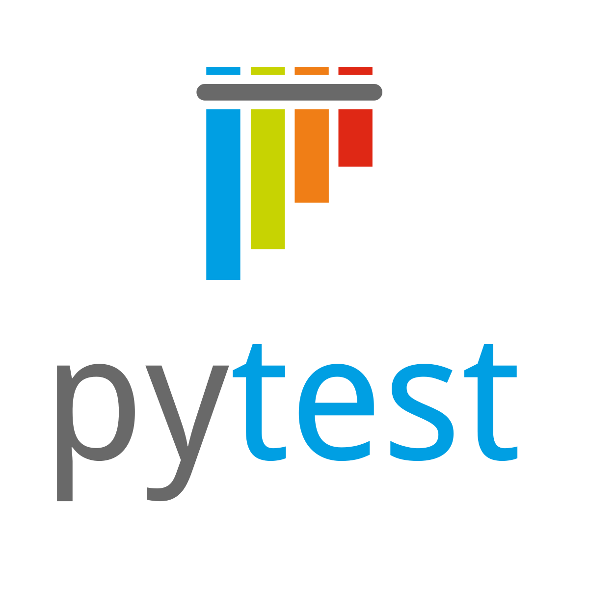

### Hi there 👋

I'm QA & QA Automation Engineer. 

For UI-tests I like to use:

I can also work with Kotlin, Maven, TestNG.

For API-test I like to use:

For API automation I can also write tests with Java + RestAssured.

## My Projects

### UI-tests automation example

Tests for site  of sport shop <a href="https://www.sportmaster.ru/">sportmaster.ru</a>.
Project was made during studying in test automation school <a href="https://qa.guru">QA.Guru</a>.

:arrow_right: [go to project](https://github.com/mifologic/qa-guru-ui-tests)

### API-tests automation example

Demo tests for site <a href="https://reqres.in">reqres.in</a>.
Project was made during studying in test automation school <a href="https://qa.guru">QA.Guru</a>.

:arrow_right: [go to project](https://github.com/mifologic/qa-guru-api-tests)

📫 How to reach me:
https://www.linkedin.com/in/mariana-plotnikova-32b55847/

<!--
**mifologic/mifologic** is a ✨ _special_ ✨ repository because its `README.md` (this file) appears on your GitHub profile.

Here are some ideas to get you started:

- 🔭 I’m currently working on ...
- 🌱 I’m currently learning ...
- 👯 I’m looking to collaborate on ...
- 🤔 I’m looking for help with ...
- 💬 Ask me about ...
- 📫 How to reach me: ...
- 😄 Pronouns: ...
- ⚡ Fun fact: ...
-->

